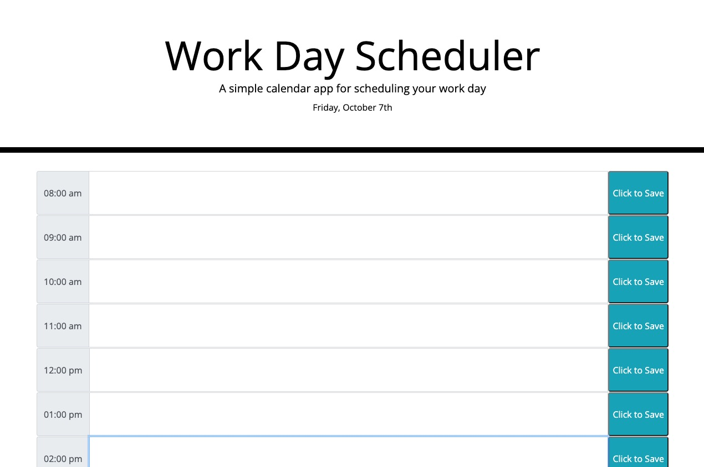

# Work-Day-Scheduler
A simple calendar application that allows a user to save events for each hour of the day.

## Description
- In this challenge I created a calendar application that allows the user to both add and save 
an event for each hour of the day.

The future of this project:
- I plan to add the colors for the hours (past, present, future).
- As well as a delete button to cancel out as needed.

---
## Website 
Click [here](url goes here) to go to my Work Day Scheduler. 

## Credits
- Thank you to the UTA-Bootcamp team.
- The Coding Collective
- Private tutor Scott Everett
- Private tutor David Elutilo

## License

Distributed under the MIT License. Please see the LICENSE.txt for more information.

---
